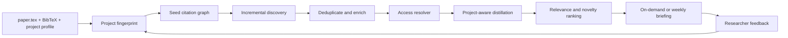

# Research Radar

> A project-aware, citation-aware literature radar that turns a research folder into an on-demand, evidence-linked research briefing.

Research Radar is intended for researchers who already have a paper in progress and do not want another generic paper-search box. When invoked, it reads the researcher's own project context—typically `paper.tex`, one or more `.bib` files, and a short project distillation—and looks for work that could change how the project is framed, modeled, positioned, or cited.

The desired experience is closer to reading a personalized research newspaper than running a literature review from scratch.

**Current status:** version 0.2.0 covers the local vertical slice: U of T /
INFORMS PDF intake, TeX and BibTeX ingestion, Crossref, OpenAlex, and Semantic
Scholar discovery, explainable ranking, persisted deep distillation,
incremental on-demand and weekly briefings, feedback, local full-text export, and a
repository-scoped Codex skill. Longitudinal validation with two researchers is
still an explicit release criterion, not a completed claim. See
[Quick start](#quick-start).

## 中文概述

每个研究项目提供三类输入：正在写的 `paper.tex`、参考文献 `.bib`，以及研究者对自己项目的 distill（研究问题、框架、机制、方法和相对现有文献的调整）。Research Radar 据此建立项目画像，持续追踪：

- 已引用论文的后续引用；
- 与种子论文共同引用或语义相近的工作；
- 指定关键词、作者、工作论文系列和期刊的新文章；
- 可能挑战、补充或抢先当前项目贡献的论文。

系统获取元数据和合法可访问的全文，按照项目自己的分析框架 distill 新论文，并在研究者调用 Skill 时生成增量报告。它的任务不是替代研究者的 taste，而是让 taste 作用在更少、更重要的候选论文上。

access-first 链路已经通过两篇真实 INFORMS 论文验证；本地 beta 也已能读取项目、
发现与筛选论文、生成日报、记录反馈，并把归档 PDF 导出为带页码的 Codex 阅读文本。

## The problem

Current academic workflows are fragmented:

1. The researcher's project model lives in TeX files, notes, and their head.
2. Citation discovery, keyword search, journal alerts, and working-paper monitoring happen in different systems.
3. Metadata discovery does not guarantee full-text access, especially for subscription journals.
4. Generic summaries describe a paper but rarely explain its relationship to the researcher's own mechanism or claimed contribution.
5. Repeated searches produce duplicates and do not learn from prior accept/ignore decisions.

Research Radar treats these as one stateful workflow.

## Product contract

Given a research project folder, the system should:

1. **Resolve access legally** from an individual DOI to a verified local PDF whenever authorization permits.
2. **Understand the project** from TeX, BibTeX, and a human-written research profile.
3. **Build a seed graph** from cited papers, papers that cite them, related authors, venues, and concepts.
4. **Discover incrementally** so each run focuses on what is new since the last successful run.
5. **Distill consistently** using the project's own conceptual and methodological schema.
6. **Rank by decision value**, not only semantic similarity.
7. **Write a reviewable briefing** with evidence, access status, and recommended actions.
8. **Learn from feedback** such as save, cite, watch, already known, off-topic, or low-value.

## Intended project protocol

Research Radar will support existing folders rather than require a new authoring environment.

```text
my-research-project/
├── paper.tex
├── references.bib
├── README.md                 # Human-written project distillation
└── .research-radar/
    ├── config.yaml           # Sources, lookback, venues, keywords
    ├── state.sqlite          # Seen papers, identifiers, runs, feedback
    ├── profile.md            # Normalized project profile
    ├── papers/               # Local full text; never committed by default
    └── reports/
        └── 2026-08-21.md
```

If the project already uses `README.md` for another purpose, `RESEARCH_PROFILE.md` will be accepted as an explicit alternative.

### Minimum research profile

The human-authored profile should answer:

- What is the research question?
- What are the core primitives, constructs, or variables?
- What is the central mechanism or causal/theoretical logic?
- What method is used: analytical model, experiment, empirical identification, simulation, or another design?
- Which assumptions or modeling choices matter most?
- What does this project change relative to the closest literature?
- Which papers are the closest competitors rather than merely background references?
- Which keywords, authors, venues, and research communities should be watched?
- What should be excluded even if it is lexically similar?

The profile is a statement of researcher taste. The system may propose edits, but it must not silently rewrite it.

## End-to-end workflow



### Discovery lanes

No single source is expected to provide sufficient recall. The planned discovery layer combines:

- backward references from the project's bibliography;
- forward citations to seed and competitor papers;
- bibliographic coupling and co-citation neighborhoods;
- title, abstract, and concept similarity;
- explicit keywords and exclusion terms;
- author, lab, conference, working-paper, and journal monitoring;
- selected journal sets such as UTD24 and domain-specific INFORMS outlets.

The implemented metadata sources are Crossref, OpenAlex, and Semantic Scholar.
Crossref supplies bibliographic, author, and venue queries; OpenAlex supplies
forward citations, related works, and keyword search; Semantic Scholar adds an
independent citation graph and backward reference neighborhood. Each source is
behind an adapter because coverage, identifiers, rate limits, and licensing
differ.

### Access resolution

Discovery and access are separate stages. A paper can be relevant even when full text is not immediately available.

The resolver will try, in order:

1. a legal open-access version;
2. an institution-aware resolver such as LibKey;
3. an authenticated library route such as U of T OpenAthens/EBSCO;
4. a publisher landing page;
5. an interlibrary-loan or author-request path.

The existing [`paper-access-router`](../paper-access-router) prototype is a technical spike for this layer. Research Radar will not bypass MFA, paywalls, license restrictions, or download limits; it will not store institutional passwords or Duo responses. Metadata-only candidates remain in the report with an explicit access label.

### Project-aware distillation

A useful entry is not just an abstract rewrite. For every high-ranked paper, the report should capture:

- research question and setting;
- theoretical or empirical framework;
- key primitives, constructs, and assumptions;
- mechanism or identification logic;
- main result and boundary conditions;
- relationship to this project;
- overlap, contradiction, complementarity, or priority risk;
- what would change in the current paper if this result were taken seriously;
- confidence and evidence provenance.

The distiller must distinguish claims supported by full text from claims inferred from metadata or abstracts.

## Briefing format

Each run produces a Markdown report designed for fast triage:

1. **Executive signal** — what changed since the last run.
2. **Top papers** — normally three to ten, ranked by expected decision value.
3. **Why each paper matters** — a direct comparison with the project profile.
4. **Framework distillation** — model, mechanism, method, and contribution.
5. **Access and evidence status** — full text, abstract only, open access, subscription, or unresolved.
6. **Recommended action** — read now, cite, monitor, competitor alert, method lead, or ignore.
7. **Search audit** — sources queried, failures, and candidates filtered out.

Reports should be append-only artifacts. Machine state may be updated, but a past report should remain reproducible from its recorded inputs and source timestamps.

## Architecture direction

The planned system has three layers:

- **Deterministic core:** a local Python CLI for parsing, identifier normalization, source adapters, deduplication, state, and report assembly.
- **Research reasoning:** a Codex skill that defines project profiling, distillation, ranking, evidence rules, and feedback handling.
- **Invocation and access:** a manually invoked Codex skill plus optional browser/library adapters that reuse user-authorized sessions.

This separation keeps stateful and testable operations out of prompts while leaving qualitative research judgment inspectable and editable. The skill runs only when the researcher invokes it or asks for a project-conditioned literature update.

## MVP definition

The first access vertical slice is complete when it can:

- open the U of T OpenAthens/EBSCO session route without touching credentials;
- route one current INFORMS DOI through LibKey or the authorized provider;
- import the downloaded PDF into `.research-radar/papers/`;
- validate that the file is an unencrypted, structurally valid PDF;
- verify that Codex can extract text under the selected `local-test` or `strict`
  analysis policy;
- record DOI, route, timestamp, checksum, page count, technical readability,
  license, and AI-use eligibility;
- avoid duplicate files and ledger entries on repeated import;
- complete the same pipeline for one open-access control paper.

Project profiling, discovery, ranking, and reporting begin only after this gate
passes with a real subscription PDF and a license-aware alternative-copy path.

## Non-goals

The initial project will not:

- become a general-purpose academic search engine;
- scrape Google Scholar or publishers in violation of their terms;
- bulk-download subscription collections;
- silently edit `paper.tex` or add citations to `.bib`;
- treat model-generated relevance scores as ground truth;
- promise complete citation coverage from any single provider;
- replace the researcher's final reading, positioning, or citation decisions.

## Quality principles

- **Incremental by default:** report what is new, not the whole literature on every invocation.
- **Evidence before fluency:** every substantive statement must identify its source level.
- **Stable identity first:** DOI and other persistent identifiers drive deduplication.
- **Taste is explicit:** positive and negative relevance criteria belong in the project profile.
- **Failures are visible:** unavailable full text, missing abstracts, and source outages are reported.
- **Local-first privacy:** unpublished manuscripts and downloaded papers stay local by default.
- **Human approval at consequential steps:** no automatic citation insertion or external sharing.

## Current access interface

The first CLI slice is implemented locally:

```sh
research-radar access session
research-radar access acquire 10.1287/mnsc.2025.00819 --project /path/to/project
research-radar access resolve 10.1287/mnsc.2025.00819 --project /path/to/project
research-radar access open 10.1287/mnsc.2025.00819
research-radar access import ~/Downloads/article.pdf \
  --doi 10.1287/mnsc.2025.00819 \
  --route uoft-ebsco \
  --project /path/to/my-research-project
research-radar access verify \
  /path/to/my-research-project/.research-radar/papers/10.1287_mnsc.2025.00819.pdf
research-radar access text 10.1287/mnsc.2025.00819 \
  --project /path/to/my-research-project
```

`access acquire` attempts exactly one bounded public/OA PDF, verifies the PDF
signature and structure, archives it, and exports page-delimited text. If the
provider requires browser authentication, it returns a LibKey handoff without
writing a fake ledger record. `access resolve` is the read-only inspection
variant. Installation and the complete browser-assisted test are documented in
[`docs/access-first.md`](docs/access-first.md). A repository-scoped, manually
invoked skill is included in the repository.

Briefings distinguish three states that must not be conflated: provider-reported
availability, verified local content (`none`, `pdf`, or exported `text`), and the
evidence actually used for the card (`metadata`, `abstract`, or `full-text`). A
provider PDF link alone never means that a local file exists or was read.

The first real U of T/INFORMS validation is recorded in
[`docs/access-validation-2026-08-21.md`](docs/access-validation-2026-08-21.md).
It confirms successful institutional PDF acquisition and also shows why access
status and AI-use permission must be tracked separately.

## Quick start

Research Radar requires Python 3.9 or newer.

```sh
git clone https://github.com/LIMYOYO/research-radar.git
cd research-radar
python3 -m venv .venv
.venv/bin/python -m pip install -e .

.venv/bin/research-radar init /path/to/my-research-project
# Fill in RESEARCH_PROFILE.md and add/keep paper.tex plus references.bib.
# A normal software README is not treated as a completed research profile.
.venv/bin/research-radar doctor --project /path/to/my-research-project
.venv/bin/research-radar run --project /path/to/my-research-project
.venv/bin/research-radar queue --scope latest --limit 3 \
  --project /path/to/my-research-project
.venv/bin/research-radar weekly --project /path/to/my-research-project
```

`run` persists exactly which candidates were new or materially updated;
`queue --scope latest` ranks only that delta and emits argv-style next commands
for one-paper acquisition and distillation. This is the interface used by the
Codex skill, so it does not have to infer workflow state from report prose.

The briefing is written under
`/path/to/my-research-project/.research-radar/reports/`. Record decisions so the
next triage learns what is already known or off topic:

```sh
.venv/bin/research-radar feedback 'doi:10.xxxx/example' off-topic \
  --project /path/to/my-research-project \
  --note 'Lexically similar, but no platform decision or strategic mechanism.'
```

For Codex, install the checked-in skill once, then invoke `$research-radar`
from any research folder:

```sh
mkdir -p ~/.codex/skills
cp -R .agents/skills/research-radar ~/.codex/skills/
```

The skill lives at
[`.agents/skills/research-radar`](.agents/skills/research-radar). It never
creates a scheduled task; each run begins only after a researcher request.

For a high-signal candidate, build the exact evidence packet and persist the
deep-reading result:

```sh
.venv/bin/research-radar distill context 'doi:10.xxxx/example' \
  --project /path/to/my-research-project
# Codex writes one JSON object matching schemas/distillation.schema.json.
.venv/bin/research-radar distill import distillation.json \
  --project /path/to/my-research-project
.venv/bin/research-radar distill show 'doi:10.xxxx/example' \
  --project /path/to/my-research-project
```

An `abstract` distillation requires an indexed abstract. A `full-text`
distillation is rejected unless an eligible local paper is present. Imported
distillations are append-only in SQLite and automatically replace the shallow
metadata summary in later offline and weekly briefings.

## What the beta does and does not do

The current ranking/distillation layer is an explainable baseline. The CLI only
states what indexed metadata and abstracts support; the Codex skill deepens the
highest-signal entries against the project framework and upgrades evidence to
`full-text` only after a local PDF is actually read. It does not automatically
edit the manuscript or bibliography, automate institutional credentials, or
bulk-download subscription content.

Run the complete test suite with:

```sh
.venv/bin/python -m unittest discover -s tests -v
```

Run the checked-in 20-candidate offline ranking evaluation with:

```sh
.venv/bin/research-radar evaluate \
  --project examples/synthetic-project \
  --fixture tests/fixtures/golden-candidates.json
```

The synthetic fixture currently records Research Radar precision@5/10 of
1.00/0.80 versus a title-and-abstract keyword baseline of 0.60/0.70, with
100% explicit identity-contract coverage and a 0% duplicate-identity rate.
These are regression checks, not a claim about real-project quality.

[`examples/anonymized-real-layout`](examples/anonymized-real-layout) adds a
nested, multi-file regression fixture derived only from private-project
directory shapes. Every substantive research field is synthetic and safe to
publish.

Example research profiles are available for
[analytical OM](examples/profiles/analytical-om.md),
[empirical business research](examples/profiles/empirical-business.md), and an
[adjacent computational field](examples/profiles/adjacent-computational.md).
The rationale for keeping the first release as a CLI plus repository skill,
rather than requiring a plugin, is documented in
[`docs/plugin-packaging-evaluation.md`](docs/plugin-packaging-evaluation.md).
The requirement-by-requirement status is recorded in
[`docs/completion-audit-2026-08-21.md`](docs/completion-audit-2026-08-21.md).

## References

- [OpenAI: Build skills](https://learn.chatgpt.com/codex/skills)
- [Semantic Scholar Academic Graph API](https://api.semanticscholar.org/api-docs/)
- [INFORMS institutional journal access](https://www.informs.org/Publications/Journal-Subscriptions)
- [University of Toronto electronic resource access](https://library.utoronto.ca/use/how-to/access-electronic-resources)

## License

MIT. See [LICENSE](LICENSE).
