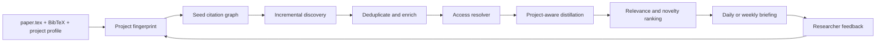

# Research Radar

> A project-aware, citation-aware literature radar that turns a research folder into a recurring, evidence-linked research briefing.

Research Radar is intended for researchers who already have a paper in progress and do not want another generic paper-search box. It reads the researcher's own project context—typically `paper.tex`, one or more `.bib` files, and a short project distillation—and continuously looks for work that could change how the project is framed, modeled, positioned, or cited.

The desired experience is closer to reading a personalized research newspaper than running a literature review from scratch.

**Current implementation priority:** before discovery or project understanding,
the project is building and validating the access channel from an individual
INFORMS DOI to a legal, local, Codex-readable PDF. See
[`docs/access-first.md`](docs/access-first.md).

## 中文概述

每个研究项目提供三类输入：正在写的 `paper.tex`、参考文献 `.bib`，以及研究者对自己项目的 distill（研究问题、框架、机制、方法和相对现有文献的调整）。Research Radar 据此建立项目画像，持续追踪：

- 已引用论文的后续引用；
- 与种子论文共同引用或语义相近的工作；
- 指定关键词、作者、工作论文系列和期刊的新文章；
- 可能挑战、补充或抢先当前项目贡献的论文。

系统获取元数据和合法可访问的全文，按照项目自己的分析框架 distill 新论文，并定期生成增量报告。它的任务不是替代研究者的 taste，而是让 taste 作用在更少、更重要的候选论文上。

当前优先级已经调整为 access-first：先打通“一篇 INFORMS 论文的 DOI →
U of T/LibKey/OpenAthens/EBSCO 合法访问 → PDF 保存到本地 → Codex 验证可读”这条链路，
再开始项目理解、自动搜索和日报功能。

## The problem

Current academic workflows are fragmented:

1. The researcher's project model lives in TeX files, notes, and their head.
2. Citation discovery, keyword search, journal alerts, and working-paper monitoring happen in different systems.
3. Metadata discovery does not guarantee full-text access, especially for subscription journals.
4. Generic summaries describe a paper but rarely explain its relationship to the researcher's own mechanism or claimed contribution.
5. Repeated searches produce duplicates and do not learn from prior accept/ignore decisions.

Research Radar treats these as one stateful workflow.

## Product contract

Given a research project folder, the system should:

1. **Resolve access legally** from an individual DOI to a verified local PDF whenever authorization permits.
2. **Understand the project** from TeX, BibTeX, and a human-written research profile.
3. **Build a seed graph** from cited papers, papers that cite them, related authors, venues, and concepts.
4. **Discover incrementally** so each run focuses on what is new since the last successful run.
5. **Distill consistently** using the project's own conceptual and methodological schema.
6. **Rank by decision value**, not only semantic similarity.
7. **Write a reviewable briefing** with evidence, access status, and recommended actions.
8. **Learn from feedback** such as save, cite, watch, already known, off-topic, or low-value.

## Intended project protocol

Research Radar will support existing folders rather than require a new authoring environment.

```text
my-research-project/
├── paper.tex
├── references.bib
├── README.md                 # Human-written project distillation
└── .research-radar/
    ├── config.yaml           # Sources, cadence, venues, keywords
    ├── state.sqlite          # Seen papers, identifiers, runs, feedback
    ├── profile.md            # Normalized project profile
    ├── papers/               # Local full text; never committed by default
    └── reports/
        └── 2026-08-21.md
```

If the project already uses `README.md` for another purpose, `RESEARCH_PROFILE.md` will be accepted as an explicit alternative.

### Minimum research profile

The human-authored profile should answer:

- What is the research question?
- What are the core primitives, constructs, or variables?
- What is the central mechanism or causal/theoretical logic?
- What method is used: analytical model, experiment, empirical identification, simulation, or another design?
- Which assumptions or modeling choices matter most?
- What does this project change relative to the closest literature?
- Which papers are the closest competitors rather than merely background references?
- Which keywords, authors, venues, and research communities should be watched?
- What should be excluded even if it is lexically similar?

The profile is a statement of researcher taste. The system may propose edits, but it must not silently rewrite it.

## End-to-end workflow



### Discovery lanes

No single source is expected to provide sufficient recall. The planned discovery layer combines:

- backward references from the project's bibliography;
- forward citations to seed and competitor papers;
- bibliographic coupling and co-citation neighborhoods;
- title, abstract, and concept similarity;
- explicit keywords and exclusion terms;
- author, lab, conference, working-paper, and journal monitoring;
- selected journal sets such as UTD24 and domain-specific INFORMS outlets.

Candidate metadata sources include Crossref, OpenAlex, Semantic Scholar, publisher feeds, and institution-provided discovery services. Each source will be implemented behind an adapter because coverage, identifiers, rate limits, and licensing differ.

### Access resolution

Discovery and access are separate stages. A paper can be relevant even when full text is not immediately available.

The resolver will try, in order:

1. a legal open-access version;
2. an institution-aware resolver such as LibKey;
3. an authenticated library route such as U of T OpenAthens/EBSCO;
4. a publisher landing page;
5. an interlibrary-loan or author-request path.

The existing [`paper-access-router`](../paper-access-router) prototype is a technical spike for this layer. Research Radar will not bypass MFA, paywalls, license restrictions, or download limits; it will not store institutional passwords or Duo responses. Metadata-only candidates remain in the report with an explicit access label.

### Project-aware distillation

A useful entry is not just an abstract rewrite. For every high-ranked paper, the report should capture:

- research question and setting;
- theoretical or empirical framework;
- key primitives, constructs, and assumptions;
- mechanism or identification logic;
- main result and boundary conditions;
- relationship to this project;
- overlap, contradiction, complementarity, or priority risk;
- what would change in the current paper if this result were taken seriously;
- confidence and evidence provenance.

The distiller must distinguish claims supported by full text from claims inferred from metadata or abstracts.

## Briefing format

Each run produces a Markdown report designed for fast triage:

1. **Executive signal** — what changed since the last run.
2. **Top papers** — normally three to ten, ranked by expected decision value.
3. **Why each paper matters** — a direct comparison with the project profile.
4. **Framework distillation** — model, mechanism, method, and contribution.
5. **Access and evidence status** — full text, abstract only, open access, subscription, or unresolved.
6. **Recommended action** — read now, cite, monitor, competitor alert, method lead, or ignore.
7. **Search audit** — sources queried, failures, and candidates filtered out.

Reports should be append-only artifacts. Machine state may be updated, but a past report should remain reproducible from its recorded inputs and source timestamps.

## Architecture direction

The planned system has three layers:

- **Deterministic core:** a local Python CLI for parsing, identifier normalization, source adapters, deduplication, state, and report assembly.
- **Research reasoning:** a Codex skill that defines project profiling, distillation, ranking, evidence rules, and feedback handling.
- **Automation and access:** scheduled runs plus optional browser/library adapters that reuse user-authorized sessions.

This separation keeps stateful and testable operations out of prompts while leaving qualitative research judgment inspectable and editable. OpenAI's current guidance supports repository-scoped skills for reusable workflows and desktop scheduled tasks that run against local project directories.

## MVP definition

The first access vertical slice is complete when it can:

- open the U of T OpenAthens/EBSCO session route without touching credentials;
- route one current INFORMS DOI through LibKey or the authorized provider;
- import the downloaded PDF into `.research-radar/papers/`;
- validate that the file is an unencrypted, structurally valid PDF;
- verify that Codex can extract text from it;
- record DOI, route, timestamp, checksum, page count, and readability;
- avoid duplicate files and ledger entries on repeated import;
- complete the same pipeline for one open-access control paper.

Project profiling, discovery, ranking, and reporting begin only after this gate
passes with a real subscription PDF.

## Non-goals

The initial project will not:

- become a general-purpose academic search engine;
- scrape Google Scholar or publishers in violation of their terms;
- bulk-download subscription collections;
- silently edit `paper.tex` or add citations to `.bib`;
- treat model-generated relevance scores as ground truth;
- promise complete citation coverage from any single provider;
- replace the researcher's final reading, positioning, or citation decisions.

## Quality principles

- **Incremental by default:** report what is new, not the whole literature every day.
- **Evidence before fluency:** every substantive statement must identify its source level.
- **Stable identity first:** DOI and other persistent identifiers drive deduplication.
- **Taste is explicit:** positive and negative relevance criteria belong in the project profile.
- **Failures are visible:** unavailable full text, missing abstracts, and source outages are reported.
- **Local-first privacy:** unpublished manuscripts and downloaded papers stay local by default.
- **Human approval at consequential steps:** no automatic citation insertion or external sharing.

## Current access interface

The first CLI slice is implemented locally:

```sh
research-radar access session
research-radar access open 10.1287/mnsc.2025.00819
research-radar access import ~/Downloads/article.pdf \
  --doi 10.1287/mnsc.2025.00819 \
  --route uoft-ebsco \
  --project /path/to/my-research-project
research-radar access verify \
  /path/to/my-research-project/.research-radar/papers/10.1287_mnsc.2025.00819.pdf
```

Installation and the complete manual test are documented in
[`docs/access-first.md`](docs/access-first.md). A repository-scoped skill and
scheduled workflow remain later milestones.

## Status

The repository is implementing Gate A0, the local access and PDF-ingestion
vertical slice. The CLI and unit tests exist; the real U of T browser test still
requires a connected, user-authenticated browser. See [PLAN.md](PLAN.md).

## References

- [OpenAI: Build skills](https://learn.chatgpt.com/docs/build-skills)
- [OpenAI: Scheduled tasks](https://learn.chatgpt.com/docs/automations)
- [INFORMS institutional journal access](https://www.informs.org/Publications/Journal-Subscriptions)
- [University of Toronto electronic resource access](https://library.utoronto.ca/use/how-to/access-electronic-resources)

## License

MIT. See [LICENSE](LICENSE).
